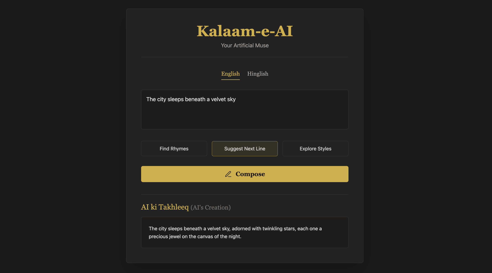

# ✒️ Kalaam-e-AI  
**Your AI-Powered Poetry Companion**  
An AI-powered creative partner designed to help poets, lyricists, and writers overcome creative blocks and explore new poetic avenues.


---

## 🖼️ Preview

<p align="center">
  
</p>

---

## ✨ Features

- **✍️ Multi-Lingual Support**: Craft poetry in both **English** and conversational **Hinglish/Urdish** (written in the Roman script).

- **🧠 Three Creative Tools**:
  - **Find Rhymes**: Input a line and get a list of creative rhyming words to spark new ideas.
  - **Suggest Next Line**: Overcome writer's block by letting the AI generate a fitting and poetic continuation to your line.
  - **Explore Styles**: Discover different poetic forms (like Ghazal, Haiku, Free Verse) that match the tone and theme of your input.

- **🎨 Elegant & Focused UI**: A clean, professional, and dark-themed interface that helps you stay in the creative zone without distractions.

## 🛠️ Tech Stack

- **Framework**: Next.js 14
- **Language**: TypeScript
- **Styling**: Tailwind CSS
- **AI Backend**: Ollama (for local model inference)
- **AI Model**: `gemma:2b` (recommended) or `llama3.2:1b`

## 🚀 Getting Started

Follow these instructions to get a copy of the project up and running on your local machine for development and testing purposes.

### Prerequisites

- [Node.js](https://nodejs.org/) (version 18 or higher)
- [Ollama](https://ollama.com/) installed and running on your machine.

### Installation

1.  **Clone the repository:**
    ```bash
    git clone [https://github.com/your-username/poetry-companion.git](https://github.com/your-username/poetry-companion.git)
    ```

2.  **Navigate to the project directory:**
    ```bash
    cd poetry-companion/nextjs-app
    ```

3.  **Install dependencies:**
    ```bash
    npm install
    ```

4.  **Set up the AI Model:**
    This project uses a local AI model via Ollama. Make sure the Ollama application is running. Then, pull the recommended model by running this command in your terminal:
    ```bash
    ollama pull gemma:2b
    ```

5.  **Run the development server:**
    ```bash
    npm run dev
    ```

6.  Open [http://localhost:3000](http://localhost:3000) with your browser to see the result.

## 🎯 How to Use

1.  **Select your language**: Choose between "English" and "Hinglish/Urdish".
2.  **Enter your line**: Type a line of poetry or a lyric into the main text area.
3.  **Choose assistance type**: Click on one of the three options: "Find Rhymes", "Suggest Next Line", or "Explore Styles".
4.  **Generate**: Click the "✨ Generate" button and wait for the AI's suggestion to appear below.

## 📁 Project Structure

Here is an overview of the key files in the project:
Of course. Here is a detailed README.md file for your Poetry Companion project. It includes a project description, features, setup instructions, and more.

You can copy this entire block and paste it directly into your README.md file.

Markdown

# ✒️ Poetry Companion AI

An AI-powered creative partner designed to help poets, lyricists, and writers overcome creative blocks and explore new poetic avenues. Get instant suggestions for rhymes, continuations, and styles in both English and Hinglish/Urdish.


## ✨ Features

- **✍️ Multi-Lingual Support**: Craft poetry in both **English** and conversational **Hinglish/Urdish** (written in the Roman script).

- **🧠 Three Creative Tools**:
  - **Find Rhymes**: Input a line and get a list of creative rhyming words to spark new ideas.
  - **Suggest Next Line**: Overcome writer's block by letting the AI generate a fitting and poetic continuation to your line.
  - **Explore Styles**: Discover different poetic forms (like Ghazal, Haiku, Free Verse) that match the tone and theme of your input.

- **🎨 Elegant & Focused UI**: A clean, professional, and dark-themed interface that helps you stay in the creative zone without distractions.

## 🛠️ Tech Stack

- **Framework**: Next.js 14
- **Language**: TypeScript
- **Styling**: Tailwind CSS
- **AI Backend**: Ollama (for local model inference)
- **AI Model**: `gemma:2b` (recommended) or `llama3.2:1b`

## 🚀 Getting Started

Follow these instructions to get a copy of the project up and running on your local machine for development and testing purposes.

### Prerequisites

- [Node.js](https://nodejs.org/) (version 18 or higher)
- [Ollama](https://ollama.com/) installed and running on your machine.

### Installation

1.  **Clone the repository:**
    ```bash
    git clone [https://github.com/your-username/poetry-companion.git](https://github.com/your-username/poetry-companion.git)
    ```

2.  **Navigate to the project directory:**
    ```bash
    cd poetry-companion/nextjs-app
    ```

3.  **Install dependencies:**
    ```bash
    npm install
    ```

4.  **Set up the AI Model:**
    This project uses a local AI model via Ollama. Make sure the Ollama application is running. Then, pull the recommended model by running this command in your terminal:
    ```bash
    ollama pull gemma:2b
    ```

5.  **Run the development server:**
    ```bash
    npm run dev
    ```

6.  Open [http://localhost:3000](http://localhost:3000) with your browser to see the result.

## 🎯 How to Use

1.  **Select your language**: Choose between "English" and "Hinglish/Urdish".
2.  **Enter your line**: Type a line of poetry or a lyric into the main text area.
3.  **Choose assistance type**: Click on one of the three options: "Find Rhymes", "Suggest Next Line", or "Explore Styles".
4.  **Generate**: Click the "✨ Generate" button and wait for the AI's suggestion to appear below.

## 📁 Project Structure

Here is an overview of the key files in the project:

nextjs-app/
└── app/
├── api/
│   └── poetry-companion/
│       └── route.ts        # Backend logic, AI prompts, and Ollama API calls
├── globals.css             # Global styling and Tailwind CSS setup
├── layout.tsx              # Root layout, font setup, and metadata
└── page.tsx                # The main frontend component and UI for the application

## 🎨 Customization

You can easily customize the application to fit your needs:

-   **AI Prompts**: Modify the prompts in `app/api/poetry-companion/route.ts` to change the AI's personality, tone, or the structure of its output.
-   **AI Model**: Change the `model` variable in the same API file to use a different Ollama model you have downloaded (e.g., `llama3.2:1b`).

-   **Styling**: Adjust colors, fonts, and layout directly in `app/globals.css` and by modifying the Tailwind CSS classes in `app/page.tsx`.

## Acknowledgements

- BlockseBlock
- Openxai
  

  ## 👤 Author
-  Syed Abdul Waheed
-  Data Science Enthusiast | Python Developer | Automation Explorer
-  📬 Connect: LinkedIn (https://www.linkedin.com/in/syed-abdul-waheed/)
- 🐙 GitHub: waheed24-03


